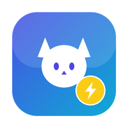

<div align="center">



# Clash Swift

原生 macOS Clash / mihomo 客户端 · SwiftUI 全窗口 + 菜单栏

<em>Native macOS Clash (mihomo) client, built with SwiftUI — full window + menu bar.</em>


</div>

---

## ✨ 特性

- 🖥️ **全窗口 + 菜单栏**：Verge 式侧边栏主窗口，配合常驻菜单栏快捷开关（启停 / 模式 / 系统代理 / 流量）
- ⚙️ **内核管理**：一键启动 / 停止 / 重启 mihomo，Rule / Global / Direct 模式切换，实时流量曲线
- 📥 **订阅 / 配置**：订阅链接下载导入、本地文件导入、内联 YAML 编辑器；显示机场用量 / 到期，支持手动更新与 6/12/24h 定时自动更新
- 🌐 **节点管理**：代理组展示与切换、单节点 / 整组延迟测速、按延迟排序、分组折叠（状态记忆）、订阅提供者更新与健康检查
- 🔗 **连接 / 规则 / 日志**：实时连接列表（搜索 / 传输过滤 / 总量 / 详情 / 关闭）、规则筛选与规则集更新、日志级别过滤与检索
- 🧭 **入站控制**：自由设置 mixed / http / socks 端口、allow-lan、IPv6、bind-address，以及自定义 `listeners` 多入站
- 🎯 **按 App 分流**：通过 `NSOpenPanel` 选择 App，自动生成 `PROCESS-NAME` / `PROCESS-PATH` 规则，强制指定应用走代理或直连
- 🛡️ **系统级路由（免开发者账号）**：TUN 模式（一次性授权 setuid，网络层全局接管）或系统代理（`networksetup` 管理员授权）
- ♻️ **崩溃自愈**：健康监控内核进程与 API（假死检测），异常时有限次自动重启（60s 内最多 3 次 + 退避），杜绝重启风暴
- 🔧 **高级维护**：日志级别切换、GEO 数据更新、清 FakeIP / DNS 缓存
- 🌍 **中英双语 + 深浅色**：界面语言与外观即时切换

## 🏗️ 架构

复用成熟核心层 + 全新宿主 VM 与 SwiftUI 界面：

```
Features/            SwiftUI 页面（Overview / Proxies / Profiles / Connections / Rules / Logs / Settings / MenuBar）
App/AppModel         宿主 ViewModel：内核生命周期、刷新、流、系统代理、覆盖层、健康监控
Services/            CoreService(进程) · MihomoAPIService(REST/WS) · ConfigService · SystemProxyFallback · Tun · Subscription · ConfigOverride
Repositories/        协议 + Default 门面（@MainActor）
UseCases/ Stores/    展示与数据容器
Models/              纯数据模型
```

- **内核控制**：`mihomo -d <workdir> -f <config> -ext-ctl <controller>`，启动前 `mihomo -t` 校验
- **入站 / 分流覆盖层**：用户设置持久化后，经 [Yams](https://github.com/jpsim/Yams) 深度合并进选中配置生成 `effective.yaml`，内核指向它 —— 重启后依然生效（区别于临时 PATCH）
- 核心层参考并迁移自 [ClashBar](https://github.com/Sitoi/ClashBar)，功能蓝图参考 [Clash Verge Rev](https://github.com/clash-verge-rev/clash-verge-rev)

## 📦 构建

要求：Xcode 16+（Swift 6）· 运行 macOS 14+

```sh
# 在 Xcode 打开 clash-swift.xcodeproj 直接 Run，或用脚本打包：
Scripts/package.sh                 # 出 dist/Clash Swift.app + Clash Swift.dmg（ad-hoc 签名）
BUNDLE_CORE=1 Scripts/package.sh   # 额外把 mihomo 核心打进 app，产出自包含 DMG
```

## 🚀 使用

1. 将 `Clash Swift.app` 拖入 `/Applications`，首次右键「打开」绕过 Gatekeeper
2. 概览页点「启动」运行内核
3. 订阅页导入机场订阅链接 → 节点页选择节点并测速
4. 系统级代理二选一：设置页开 **TUN**（推荐，一次授权长期有效）或概览页开 **系统代理**（每次授权）

> 运行时数据目录：`~/Library/Application Support/clashbar`
> 内置内核复制到：`~/Library/Application Support/clashbar/core/mihomo`

## ⚠️ 关于签名

本项目使用 **ad-hoc 签名**，无需 Apple 开发者账号：

- 自用完全可用；分发给他人会被 Gatekeeper 拦截，需接收方右键「打开」
- 系统代理 / TUN 通过**管理员授权**实现（而非特权 helper），因此开关时可能弹出密码

## 🙏 致谢

- [MetaCubeX/mihomo](https://github.com/MetaCubeX/mihomo) — 内核
- [Sitoi/ClashBar](https://github.com/Sitoi/ClashBar) — 核心层实现参考
- [clash-verge-rev](https://github.com/clash-verge-rev/clash-verge-rev) — 功能蓝图

## 📄 许可证

本项目基于 [GPL-3.0](./LICENSE) 开源。因核心层迁移自同为 GPL-3.0 的 ClashBar，本项目亦遵循 GPL-3.0。
